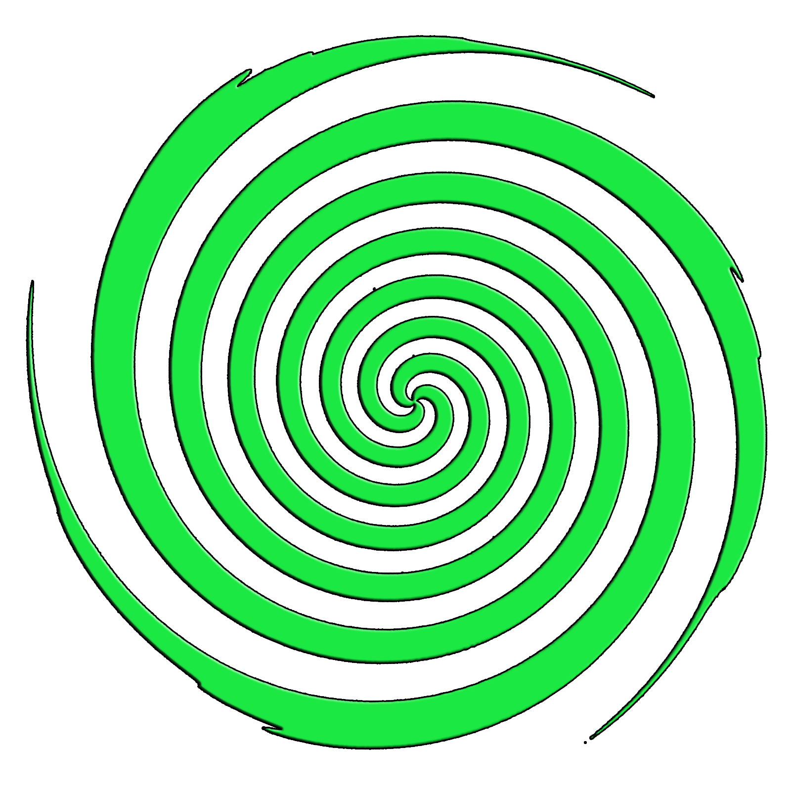

<<<<<<< HEAD
#  WE-SPORTS V0.031

=======
# WE-SPORTS V0.031

>>>>>>> d161609167c8c5a182557e6b474329fea07b8584

## Esse é um site institucional individual desenvolvido com propositos escolares.

### Versão 0.01
- Criei os repositorios onde vão ficar todos os arquivos
- Adicionei as imagens usadas no prototipo utilizadas no FIGMA
- Criei um README.md com um resumo do Projeto

### Versão 0.02
- Criei o Index do Site
- Comecei a desenvolver a estrutura base
- Adicionei uma Nav-bar Com a LOGO e botões funcionais, e um input text.
- Adicionei estilo pra Nav-Bar e o Corpo da Página

### Versão 0.03
- Finalizei a estrutura base do site
- Adicionei algumas funções e estilos
- Arrumei problemas gerais
- Fiz o Footer base com a LOGO e algumas informações

### Versão 0.031
- Defini o Projeto para Monitores 1440x900
